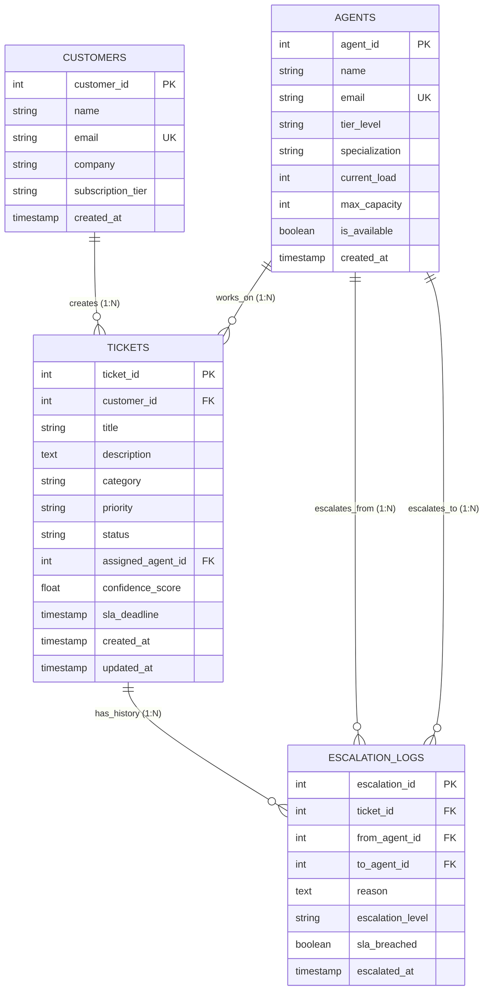

# Entity-Relationship (ER) Model & Database Design (DBMS Unit 1)

This document specifies the conceptual, logical, and physical database design for the **Intelligent SaaS Helpdesk Ticket Resolution & Escalation Management System**.

---

## 1. Problem Context: The SaaS Disconnect

In modern SaaS organizations, customer tickets frequently arrive without direct linkages to:
1. Historical account records and prior complaints.
2. Active subscription SLA commitments (Enterprise vs. Pro vs. Free).
3. Past escalation logs detailing who touched the ticket and why.

This schema eliminates orphaned tickets by enforcing strict referential integrity (`FOREIGN KEY ... ON DELETE CASCADE/SET NULL`) and structured audit trails.

---

## 2. Mermaid Entity-Relationship (ER) Diagram

---

## 3. Entity Specifications & Attributes

| Entity | Primary Key | Key Attributes | Constraints & Domain Rules |
| :--- | :--- | :--- | :--- |
| **`CUSTOMERS`** | `customer_id` (Auto-Increment) | `name`, `email`, `company`, `subscription_tier`, `created_at` | `email` is `UNIQUE`. `subscription_tier` IN (`Free`, `Pro`, `Enterprise`). |
| **`AGENTS`** | `agent_id` (Auto-Increment) | `name`, `email`, `tier_level`, `specialization`, `current_load`, `max_capacity`, `is_available` | `tier_level` IN (`L1`, `L2`, `L3`, `Specialist_Lead`). `specialization` IN (`Billing`, `Technical`, `Auth_Access`, `Bug_Report`, `General`). `current_load <= max_capacity`. |
| **`TICKETS`** | `ticket_id` (Auto-Increment) | `customer_id`, `title`, `description`, `category`, `priority`, `status`, `assigned_agent_id`, `confidence_score`, `sla_deadline` | `customer_id` references `CUSTOMERS.customer_id` `ON DELETE CASCADE`. `priority` IN (`Low`, `Medium`, `High`, `Critical`). `status` IN (`Open`, `Assigned`, `In_Progress`, `Escalated`, `Resolved`, `Closed`). |
| **`ESCALATION_LOGS`** | `escalation_id` (Auto-Increment) | `ticket_id`, `from_agent_id`, `to_agent_id`, `reason`, `escalation_level`, `sla_breached`, `escalated_at` | `ticket_id` references `TICKETS.ticket_id` `ON DELETE CASCADE`. `from_agent_id` and `to_agent_id` reference `AGENTS.agent_id`. |

---

## 4. Normalization Justification (1NF $\to$ 2NF $\to$ 3NF)

### First Normal Form (1NF)
- All attributes are atomic (no multi-valued columns or repeating groups).
- Each table possesses a designated Primary Key.

### Second Normal Form (2NF)
- In 1NF and contains **no partial dependencies**. 
- All non-key attributes are fully functionally dependent on the entire primary key (since every table uses a single-attribute surrogate integer PK).

### Third Normal Form (3NF)
- In 2NF and contains **no transitive dependencies** ($X \to Y \to Z$).
- Non-key attributes depend *only* on the primary key, directly:
  - Agent load and specialization belong strictly to `AGENTS`.
  - Customer tier belongs strictly to `CUSTOMERS`.
  - Escalation metadata belongs strictly to `ESCALATION_LOGS`.
